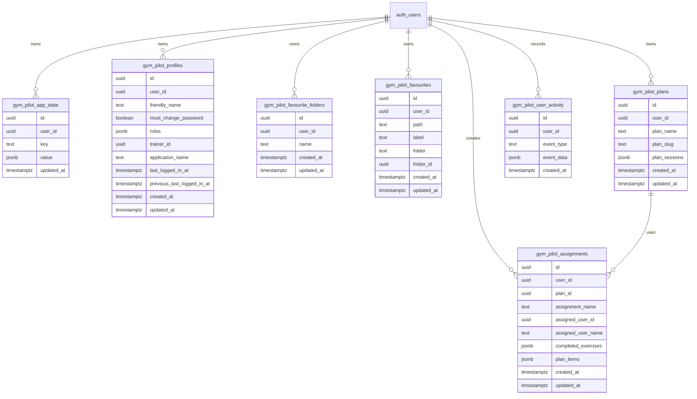

# Gym Pilot data schema

## Data types

### Exercise
Represents a browsable exercise entry used on the home page and exercise detail pages.

- id: string
- name: string
- category: string
- body_part: string
- equipment: string
- instructions: { en: string }
- instruction_steps: { en: string[] }
- muscle_group: string
- secondary_muscles: string[]
- target: string
- image: string
- gif_url: string
- media_id: string
- created_at: string
- attribution: string

### Plan
Represents a base training plan created by a trainer or user and used as a template.

- id: string
- planName: string
- planSlug: string
- exercises: PlanItem[]

### Assignment
Represents a user-specific assignment that references a Plan and owns completion state for that user.

- id: string
- planId: string
- planName: string
- planSlug: string
- assignedUserId?: string
- assignedUserName?: string
- completedExercises?: Record<string, string>
- planItems: PlanItem[]
- per-item user data is stored on each PlanItem, such as reps, weight, or other completion values

### PlanItem
A plan-specific entry that references an Exercise by ID and can carry assignment-specific values.

- exerciseId: string
- note: string
- user data such as reps, weight, or completion values can be stored on this item

### User
Represents a person who can be assigned to plans and given a role.

- id: string
- name: string
- slug: string
- role: admin | trainer | client | guest

### Profile
Stores optional profile metadata for the authenticated Supabase user.

- id: string
- user_id: string
- friendly_name: string | null
- created_at: string
- updated_at: string

### Favourite folder
Groups favourite shortcuts for easier organisation.

- id: string
- user_id: string
- name: string
- created_at: string
- updated_at: string

### Favourite link
Represents a saved navigation shortcut or exercise shortcut.

- id: string
- user_id: string
- path: string
- label: string
- folder: string | null
- folder_id: string | null
- created_at: string
- updated_at: string

## Storage model
The app now has a local-first data layer based on Dexie and a query layer based on TanStack Query.

- Dexie stores key/value records in IndexedDB.
- TanStack Query is used for API-backed state and caching.

## Supabase schema
The current Supabase schema is defined in the consolidated migration [supabase/migrations/20260718160000_consolidated_current_schema.sql](supabase/migrations/20260718160000_consolidated_current_schema.sql).

### Entity relationship overview

### Notes
- a shared app state table for user-scoped key/value persistence
- a profile table for friendly names and optional user metadata
- a favourites table plus folders for saved exercise and link shortcuts
- a plans table for plan templates
- an assignments table for user-specific plan assignments
- row-level security policies for authenticated users
- auth metadata can mark a user as requiring a password change on next sign-in

The schema is intentionally consolidated into a single migration so the profile, favourites, assignments, and activity tables can be applied together while remaining safe for existing environments.
