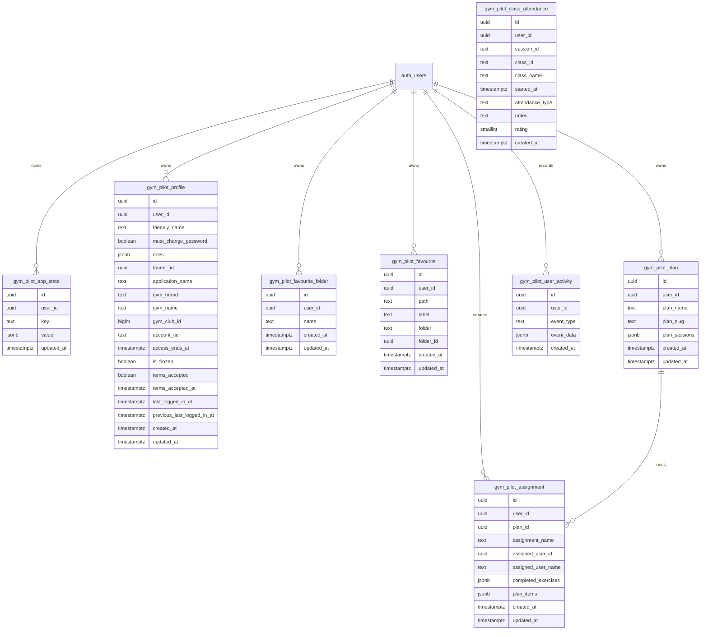

# Gym Pilot data schema

## Data types

### Exercise
Represents a browsable exercise entry used on the home page and exercise detail pages.

- id: string
- name: string
- category: string
- body_part: string
- equipment: string
- instructions: { en: string }
- instruction_steps: { en: string[] }
- muscle_group: string
- secondary_muscles: string[]
- target: string
- image: string
- gif_url: string
- media_id: string
- created_at: string
- attribution: string

### Plan
Represents a base training plan created by a trainer or user and used as a template.

- id: string
- planName: string
- planSlug: string
- exercises: PlanItem[]

### Assignment
Represents a user-specific assignment that references a Plan and owns completion state for that user.

- id: string
- planId: string
- planName: string
- planSlug: string
- assignedUserId?: string
- assignedUserName?: string
- completedExercises?: Record<string, string>
- planItems: PlanItem[]
- per-item user data is stored on each PlanItem, such as reps, weight, or other completion values

### PlanItem
A plan-specific entry that references an Exercise by ID and can carry assignment-specific values.

- exerciseId: string
- note: string
- user data such as reps, weight, or completion values can be stored on this item

### User
Represents a person who can be assigned to plans and given a role.

- id: string
- name: string
- slug: string
- role: admin | trainer | client | guest

### Profile
Stores optional profile metadata for the authenticated Supabase user.

- id: string
- user_id: string
- friendly_name: string | null
- terms_accepted: boolean
- terms_accepted_at: string | null
- created_at: string
- updated_at: string

### Favourite folder
Groups favourite shortcuts for easier organisation.

- id: string
- user_id: string
- name: string
- created_at: string
- updated_at: string

### Favourite link
Represents a saved navigation shortcut or exercise shortcut.

- id: string
- user_id: string
- path: string
- label: string
- folder: string | null
- folder_id: string | null
- created_at: string
- updated_at: string

## Storage model
The app now has a local-first data layer based on Dexie and a query layer based on TanStack Query.

- Dexie stores key/value records in IndexedDB.
- TanStack Query is used for API-backed state and caching.

## Supabase schema
The current Supabase schema is defined in the migrations folder [supabase/migrations](supabase/migrations).

### Supabase call inventory
The shared Supabase helpers in [packages/shared/src/gymPilotSupabase.ts](packages/shared/src/gymPilotSupabase.ts) centralise the app's remote persistence and auth calls. When this surface changes, update this section and the Mermaid diagram below.

| Area | Current call patterns | Tables / resources |
| --- | --- | --- |
| Auth and session | `client.auth.getSession()`, `client.auth.signInWithOAuth()`, `client.auth.signInWithPassword()`, `client.auth.signUp()`, `client.auth.resetPasswordForEmail()`, `client.auth.updateUser()`, `client.auth.signOut()` | Supabase Auth users and session state |
| Profiles and settings | `loadSupabaseProfileSnapshot()`, `saveSupabaseProfileName()`, `saveSupabaseApplicationName()`, `saveSupabaseGymBrand()`, `saveSupabaseGymName()`, `saveSupabaseProfileAccessSettings()`, `saveSupabaseProfileFlag()`, `saveSupabaseProfileLastLoggedIn()`, `loadSupabaseProfileTermsAcceptance()`, `saveSupabaseProfileTermsAcceptance()` | `gym_pilot_profile` |
| Key/value persistence | `loadSupabaseJsonRecord()`, `saveSupabaseJsonRecord()`, `removeSupabaseJsonRecord()` | `gym_pilot_app_state` plus table-specific rows for plans, assignments, favourites, and app state |
| Plans and assignments | `select`, `insert`, `upsert`, `delete` against remote rows | `gym_pilot_plan`, `gym_pilot_assignment` |
| Favourites and folders | `select`, `insert`, `upsert`, `delete` against remote rows | `gym_pilot_favourite_folder`, `gym_pilot_favourite` |
| Activity logging | `recordSupabaseUserActivity()` uses `insert` into `gym_pilot_user_activity`; it skips inserts when the app is running on localhost-style hosts | `gym_pilot_user_activity` |
| Timetable attendance | `saveTimetableAttendance()` inserts role-based attendance records with optional notes and a 1-5 rating for a session/class | `gym_pilot_class_attendance` |

### Entity relationship overview

### Notes
- a shared app state table for user-scoped key/value persistence
- a profile table for friendly names, gym brand/club metadata, optional user settings, and the terms-and-conditions acceptance state used by the welcome flow
- a favourites table plus folders for saved exercise and link shortcuts
- a plans table for plan templates
- an assignments table for user-specific plan assignments
- row-level security policies for authenticated users
- auth metadata can mark a user as requiring a password change on next sign-in

### Client-side preference storage
The app currently keeps UI preferences such as theme choice and the version banner visibility in browser storage rather than Supabase.

- `gym-pilot-theme-preference` is stored in localStorage and controls the light/dark theme
- `gym-pilot-show-version` is stored in localStorage and controls whether the build/version banner is shown

These values are intentionally kept client-side because they are lightweight UI preferences rather than shared domain data. They are suitable for localStorage unless the product later decides that preferences should follow a user across devices or be managed as part of a broader profile experience.

The schema is intentionally consolidated into a single migration so the profile, favourites, assignments, and activity tables can be applied together while remaining safe for existing environments.
