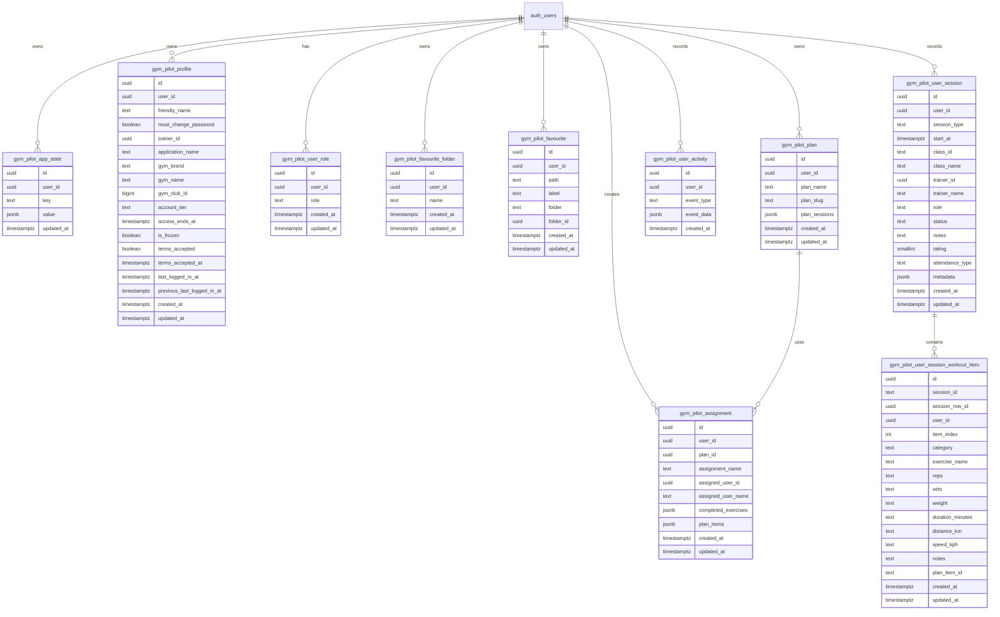

# Gym Pilot data schema

## Data types

### App setting

| Field         | Type                    | Notes                     |
| ------------- | ----------------------- | ------------------------- |
| id            | string                  | Primary key               |
| setting_key   | string                  | Unique setting identifier |
| setting_value | Record<string, unknown> | Stored JSON payload       |
| created_at    | string                  | Creation timestamp        |
| updated_at    | string                  | Last update timestamp     |

### Assignment

| Field               | Type                    | Notes                          |
| ------------------- | ----------------------- | ------------------------------ |
| id                  | string                  | Primary key                    |
| user_id             | string                  | Owner of the assignment        |
| plan_id             | string                  | Related plan template          |
| assignment_name     | string                  | Friendly assignment title      |
| assigned_user_id    | string \| null          | Optional assignee              |
| assigned_user_name  | string \| null          | Optional assignee display name |
| completed_exercises | Record<string, unknown> | Completion tracking payload    |
| plan_items          | PlanItem[]              | Assignment-specific plan rows  |
| created_at          | string                  | Creation timestamp             |
| updated_at          | string                  | Last update timestamp          |

### Audit log

| Field      | Type                            | Notes                   |
| ---------- | ------------------------------- | ----------------------- |
| id         | string                          | Primary key             |
| message    | string                          | Audit event description |
| details    | Record<string, unknown> \| null | Optional payload        |
| created_at | string                          | Creation timestamp      |

### Error log

| Field      | Type                            | Notes                  |
| ---------- | ------------------------------- | ---------------------- |
| id         | string                          | Primary key            |
| message    | string                          | Error description      |
| details    | Record<string, unknown> \| null | Optional error payload |
| created_at | string                          | Creation timestamp     |

### Exercise

| Field             | Type             | Notes                           |
| ----------------- | ---------------- | ------------------------------- |
| id                | string           | Primary key                     |
| name              | string           | Exercise name                   |
| category          | string           | Exercise category               |
| body_part         | string           | Main body part                  |
| equipment         | string           | Equipment requirement           |
| instructions      | { en: string }   | Localised instructions          |
| instruction_steps | { en: string[] } | Localised step-by-step guidance |
| muscle_group      | string           | Primary muscle group            |
| secondary_muscles | string[]         | Secondary muscle groups         |
| target            | string           | Target focus                    |
| image             | string           | Image path                      |
| gif_url           | string           | GIF media path                  |
| media_id          | string           | Media reference                 |
| created_at        | string           | Creation timestamp              |
| attribution       | string           | Source attribution              |

### Favourite folder

| Field      | Type   | Notes                 |
| ---------- | ------ | --------------------- |
| id         | string | Primary key           |
| user_id    | string | Owner of the folder   |
| name       | string | Folder label          |
| created_at | string | Creation timestamp    |
| updated_at | string | Last update timestamp |

### Favourite link

| Field      | Type           | Notes                     |
| ---------- | -------------- | ------------------------- |
| id         | string         | Primary key               |
| user_id    | string         | Owner of the link         |
| path       | string         | Route or target path      |
| label      | string         | Display label             |
| folder     | string \| null | Optional folder name      |
| folder_id  | string \| null | Optional folder reference |
| created_at | string         | Creation timestamp        |
| updated_at | string         | Last update timestamp     |

### Plan

| Field         | Type          | Notes                       |
| ------------- | ------------- | --------------------------- |
| id            | string        | Primary key                 |
| user_id       | string        | Plan owner                  |
| plan_name     | string        | Plan title                  |
| plan_slug     | string        | URL-friendly slug           |
| plan_sessions | PlanSession[] | Nested plan session payload |
| created_at    | string        | Creation timestamp          |
| updated_at    | string        | Last update timestamp       |

### PlanItem

| Field      | Type   | Notes               |
| ---------- | ------ | ------------------- |
| exerciseId | string | Referenced exercise |
| note       | string | Optional note       |

### Profile

| Field             | Type           | Notes                 |
| ----------------- | -------------- | --------------------- |
| id                | string         | Primary key           |
| user_id           | string         | Supabase auth user    |
| friendly_name     | string \| null | Display name          |
| terms_accepted    | boolean        | Acceptance flag       |
| terms_accepted_at | string \| null | Acceptance timestamp  |
| created_at        | string         | Creation timestamp    |
| updated_at        | string         | Last update timestamp |

### Session workout item

| Field            | Type                                                       | Notes                          |
| ---------------- | ---------------------------------------------------------- | ------------------------------ |
| id               | string                                                     | Primary key                    |
| session_id       | string                                                     | Parent session identifier      |
| session_row_id   | string \| null                                             | Optional session row reference |
| user_id          | string                                                     | Owner of the workout row       |
| item_index       | number                                                     | Position within the session    |
| category         | exercise \| warm_up \| stretch \| cool_down \| run \| spin | Workout item category          |
| exercise_name    | string \| null                                             | Exercise label                 |
| reps             | string \| null                                             | Repetition value               |
| sets             | string \| null                                             | Set count                      |
| weight           | string \| null                                             | Weight value                   |
| duration_minutes | string \| null                                             | Duration value                 |
| distance_km      | string \| null                                             | Distance value                 |
| speed_kph        | string \| null                                             | Speed value                    |
| notes            | string \| null                                             | Optional notes                 |
| plan_item_id     | string \| null                                             | Optional related plan item     |
| created_at       | string                                                     | Creation timestamp             |
| updated_at       | string                                                     | Last update timestamp          |

### User

| Field | Type                                | Notes                   |
| ----- | ----------------------------------- | ----------------------- |
| id    | string                              | Primary key             |
| name  | string                              | Display name            |
| slug  | string                              | URL-friendly identifier |
| role  | admin \| trainer \| client \| guest | Assigned role           |

### User role

| Field      | Type                                | Notes                  |
| ---------- | ----------------------------------- | ---------------------- |
| id         | string                              | Primary key            |
| user_id    | string                              | User who owns the role |
| role       | admin \| trainer \| client \| guest | Assigned role          |
| created_at | string                              | Creation timestamp     |
| updated_at | string                              | Last update timestamp  |

### User session

| Field            | Type                                                           | Notes                      |
| ---------------- | -------------------------------------------------------------- | -------------------------- |
| id               | string                                                         | Primary key                |
| user_id          | string \| null                                                 | Session owner              |
| session_type     | class \| personal_training \| solo                             | Session category           |
| start_at         | string                                                         | Start timestamp            |
| duration_minutes | number \| null                                                 | Optional duration          |
| trainer_id       | string \| null                                                 | Optional trainer reference |
| trainer_name     | string \| null                                                 | Optional trainer label     |
| class_id         | string \| null                                                 | Optional class reference   |
| class_name       | string \| null                                                 | Optional class label       |
| location         | string \| null                                                 | Optional location          |
| capacity         | number \| null                                                 | Optional capacity          |
| price            | number \| null                                                 | Optional price             |
| metadata         | Record<string, unknown> \| null                                | Session metadata payload   |
| role             | client \| trainer \| null                                      | User role for the session  |
| status           | booked \| cancelled \| attended \| no_show \| declined \| null | Booking state              |
| notes            | string \| null                                                 | Optional notes             |
| rating           | number \| null                                                 | Optional rating            |
| attendance_type  | attended \| taught \| null                                     | Attendance classification  |
| created_at       | string                                                         | Creation timestamp         |
| updated_at       | string                                                         | Last update timestamp      |

## Storage model

The app now has a local-first data layer based on Dexie and a query layer based on TanStack Query.

- Dexie stores key/value records in IndexedDB.
- TanStack Query is used for API-backed state and caching.

## Supabase schema

The current Supabase schema is defined in the migrations folder [supabase/migrations](supabase/migrations).

### Supabase call inventory

The shared Supabase helpers in [packages/shared/src/gymPilotSupabase.ts](packages/shared/src/gymPilotSupabase.ts) centralise the app's remote persistence and auth calls. When this surface changes, update this section and the Mermaid diagram below.

| Area                    | Current call patterns                                                                                                                                                                                                                                                                                                                                                                                 | Tables / resources                                                                               |
| ----------------------- | ----------------------------------------------------------------------------------------------------------------------------------------------------------------------------------------------------------------------------------------------------------------------------------------------------------------------------------------------------------------------------------------------------- | ------------------------------------------------------------------------------------------------ |
| Auth and session        | `client.auth.getSession()`, `client.auth.signInWithOAuth()`, `client.auth.signInWithPassword()`, `client.auth.signUp()`, `client.auth.resetPasswordForEmail()`, `client.auth.updateUser()`, `client.auth.signOut()`                                                                                                                                                                                   | Supabase Auth users and session state                                                            |
| Profiles and settings   | `loadSupabaseProfileSnapshot()`, `saveSupabaseProfileName()`, `saveSupabaseApplicationName()`, `saveSupabaseGymBrand()`, `saveSupabaseGymName()`, `saveSupabaseProfileAccessSettings()`, `saveSupabaseProfileFlag()`, `saveSupabaseProfileLastLoggedIn()`, `loadSupabaseProfileTermsAcceptance()`, `saveSupabaseProfileTermsAcceptance()`, `loadSupabaseProfileRoles()`, `saveSupabaseProfileRoles()` | `gym_pilot_profile`, `gym_pilot_user_role`                                                       |
| Key/value persistence   | `loadSupabaseJsonRecord()`, `saveSupabaseJsonRecord()`, `removeSupabaseJsonRecord()`                                                                                                                                                                                                                                                                                                                  | `gym_pilot_app_state` plus table-specific rows for plans, assignments, favourites, and app state |
| Plans and assignments   | `select`, `insert`, `upsert`, `delete` against remote rows                                                                                                                                                                                                                                                                                                                                            | `gym_pilot_plan`, `gym_pilot_assignment`                                                         |
| Favourites and folders  | `select`, `insert`, `upsert`, `delete` against remote rows                                                                                                                                                                                                                                                                                                                                            | `gym_pilot_favourite_folder`, `gym_pilot_favourite`                                              |
| Activity logging        | `recordSupabaseUserActivity()` uses `insert` into `gym_pilot_user_activity`; it skips inserts when the app is running on localhost-style hosts                                                                                                                                                                                                                                                        | `gym_pilot_user_activity`                                                                        |
| Session recording       | `saveTimetableAttendance()` inserts role-based session records with optional notes and a 1-5 rating for a session/class                                                                                                                                                                                                                                                                               | `gym_pilot_user_session`                                                                         |
| Workout items           | `loadWorkoutItemsForSession()` and `saveWorkoutItemsForSession()` read/write ordered workout rows for a session                                                                                                                                                                                                                                                                                       | `gym_pilot_user_session_workout_item`                                                            |
| Error and audit logging | `persistErrorLog()` and `persistAuditLog()` write to `gym_pilot_error_log` and `gym_pilot_audit_log` only when the matching app settings are enabled                                                                                                                                                                                                                                                  | `gym_pilot_error_log`, `gym_pilot_audit_log`                                                     |

### Entity relationship overview

### Notes

- a shared app state table for user-scoped key/value persistence
- a profile table for friendly names, gym brand/club metadata, optional user settings, and the terms-and-conditions acceptance state used by the welcome flow
- a favourites table plus folders for saved exercise and link shortcuts
- a plans table for plan templates
- an assignments table for user-specific plan assignments
- a dedicated workout-item table for session workout rows so workout data can be queried independently from the session metadata payload
- row-level security policies for authenticated users
- auth metadata can mark a user as requiring a password change on next sign-in

### Client-side preference storage

The app currently keeps UI preferences such as theme choice and the version banner visibility in browser storage rather than Supabase.

- `gym-pilot-theme-preference` is stored in localStorage and controls the light/dark theme

These values are intentionally kept client-side because they are lightweight UI preferences rather than shared domain data. They are suitable for localStorage unless the product later decides that preferences should follow a user across devices or be managed as part of a broader profile experience.

The schema is intentionally consolidated into a single migration so the profile, favourites, assignments, and activity tables can be applied together while remaining safe for existing environments.
